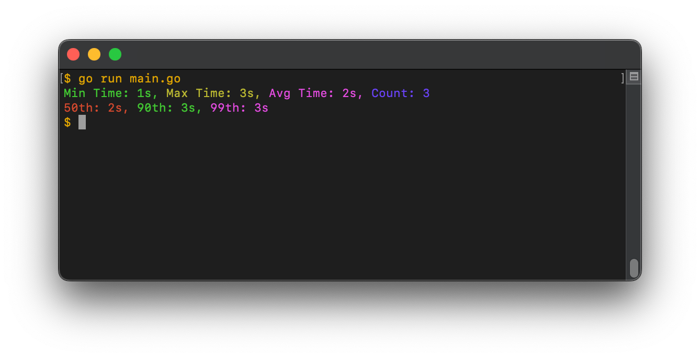

# PrettyTimer



## Example code
```go
package main

import (
	"fmt"
	"time"

	"github.com/8ff/prettyTimer"
)

func main() {
	ts := prettyTimer.NewTimingStats()

	// Using Start and Finish to record timing
	ts.Start()
	time.Sleep(1 * time.Second) // Simulating some work
	ts.Finish()

	// Using RecordTiming to manually record timings
	start := time.Now()
	ts.RecordTiming(time.Since(start))
	ts.RecordTiming(time.Since(start))
	ts.RecordTiming(time.Since(start))

	// Print stats to console
	ts.PrintStats()

	// Return stats and get single value
	stats := ts.GetStats()
	fmt.Printf("99th percentile: %s\n", stats.Percent99)
}

```

## Example from [examples/main.go](examples/main.go)
```bash
$ examples % go run main.go 
Min Time: 1s, Max Time: 3s, Avg Time: 2s, Count: 3
50th: 2s, 90th: 3s, 99th: 3s
```
